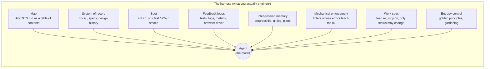
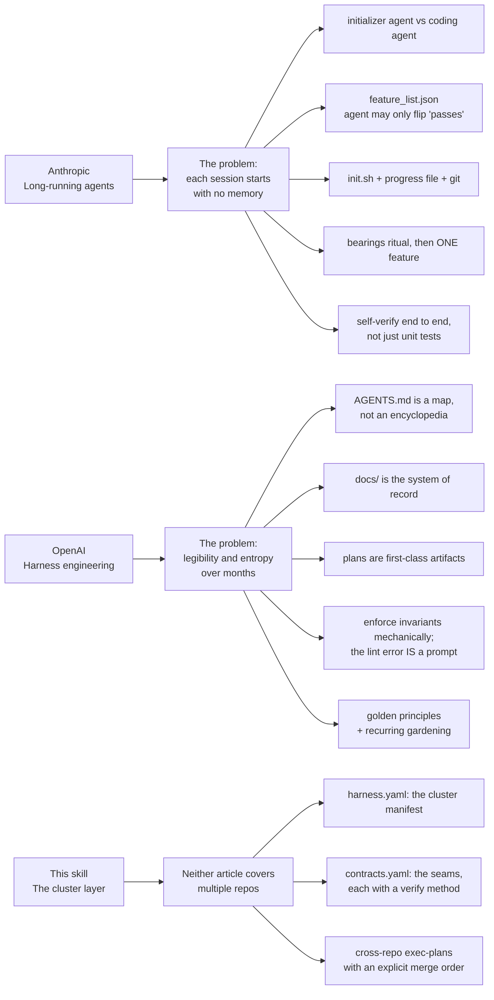
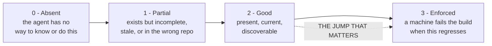
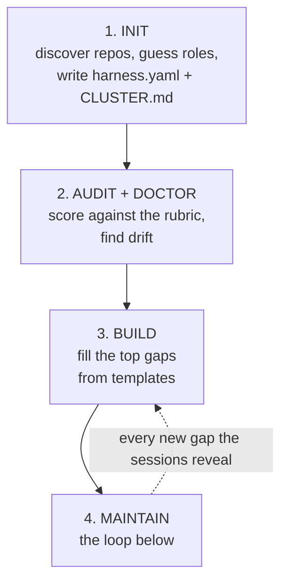
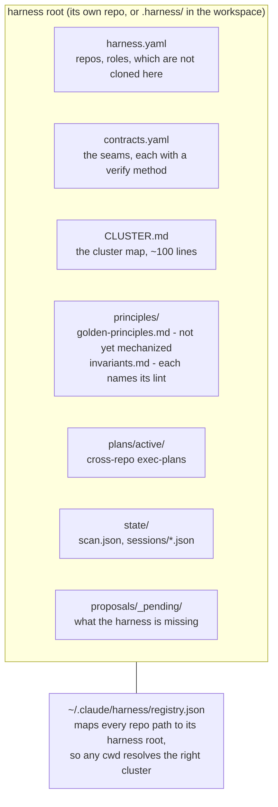
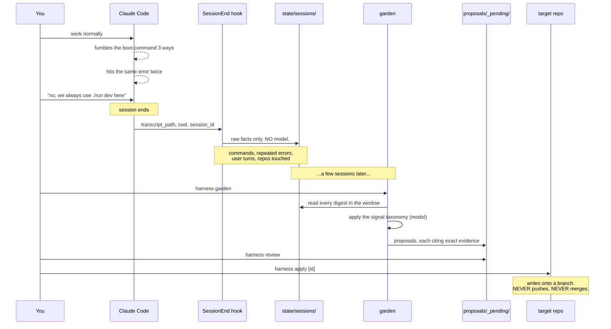
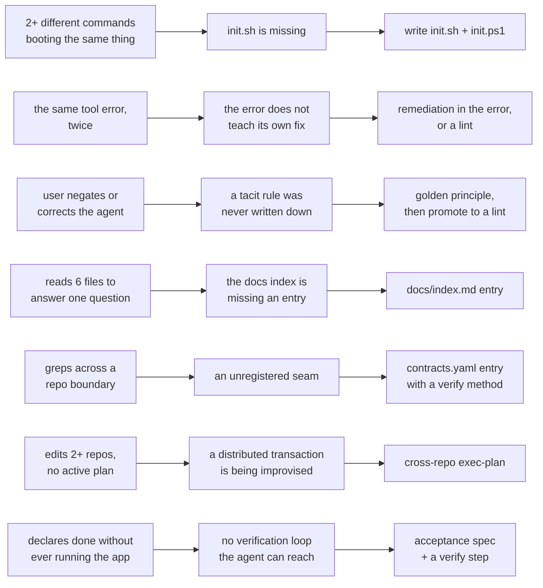
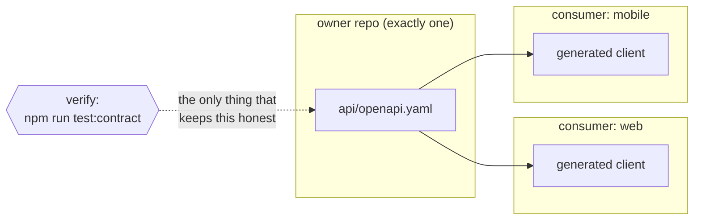
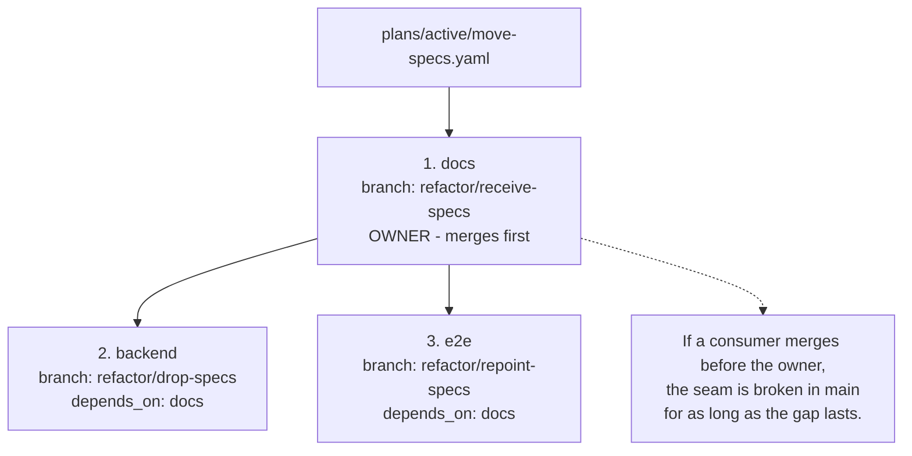

# Harness engineering: a methodology for repo clusters

> The design and reasoning behind the [`harness-engineering`](../skills/harness-engineering/) skill.
>
> Sources:
> [Anthropic, *Effective harnesses for long-running agents*](https://www.anthropic.com/engineering/effective-harnesses-for-long-running-agents) (Nov 2025) and
> [OpenAI, *Harness engineering: leveraging Codex in an agent-first world*](https://openai.com/index/harness-engineering/) (Feb 2026).

---

## 1. What a harness is

A **harness** is everything around the agent that is not the model: the map it reads on arrival, the
script that boots the app, the spec that defines done, the linter that says no, the plan that survives
the context window.



Both source articles converged on the same finding, from opposite directions:

> **When an agent underperforms, the environment is usually underspecified. The fix is almost never
> "try harder."**

OpenAI states it as a reflex their team adopted: when Codex struggled, a human never stepped in to write
the code. They asked *what capability is missing, and how do we make it both legible and enforceable?* -
and then had Codex build that capability.

That reflex is the entire methodology. Everything below is machinery for applying it consistently.

---

## 2. What each source contributes

The two articles are complementary, not redundant.



### Anthropic: memory across the context boundary

An agent works in discrete sessions, each starting with no memory. The mental model they use: a project
staffed by engineers working in shifts, where every new engineer arrives remembering nothing.

Compaction alone is not enough. Two failures follow predictably:

- **One-shotting.** The agent tries to do everything at once, runs out of context mid-implementation,
  and leaves a half-built undocumented feature. The next session guesses at what happened and burns its
  budget getting back to a working state.
- **Premature victory.** Later in a project, an agent looks around, sees progress exists, and declares
  the job done.

One detail worth stealing verbatim: the work spec is **JSON, not Markdown**. Not a style preference -
they found models are measurably less likely to inappropriately rewrite a JSON file they were told not
to touch. A spec the agent feels free to edit is not a spec.

### OpenAI: legibility and entropy

Three engineers (later seven) shipped roughly a million lines across ~1500 PRs in five months with
**zero manually written code**. The scarce resource was never the model. It was human time and attention.

Their "one big AGENTS.md" attempt failed in four ways, and the list is worth memorizing because every
one of them is a trap you will otherwise walk into:

1. **Context is scarce.** A giant instruction file crowds out the task, the code, and the relevant docs.
2. **Too much guidance becomes non-guidance.** When everything is important, nothing is, and agents
   pattern-match locally instead of navigating intentionally.
3. **It rots instantly.** A monolithic manual becomes a graveyard of stale rules. Agents cannot tell
   what is still true, humans stop maintaining it.
4. **It is unverifiable.** A single blob does not admit mechanical checks for coverage, freshness,
   ownership, or cross-links.

The replacement is ~100 lines acting as a map, plus a structured `docs/` that is the real system of
record. Progressive disclosure: a small stable entry point that teaches the agent where to look next.

The other idea with disproportionate leverage: **the lint error message is a prompt.** It lands in the
agent's context exactly when it is relevant, addressed to exactly the agent that needs it. So do not
write `error: invalid import`. Write:

```
error: service.py imports from ui/ (layer violation: service must not depend on ui)
       Move the shared type into types/, or invert the dependency.
       See principles/invariants.md#layering.
```

The first makes the agent guess. The second closes the loop.

### The cluster layer

Both articles are written for a single repository. Inside one repo, a linter can hold a line. **Across
repos, nothing does.** That is where harnesses actually tear, and it is what this skill adds.

---

## 3. The rubric: 11 dimensions, 0 to 3



Score 2 is a document asking nicely. Score 3 is a machine saying no. Under agent throughput, prose does
not hold a line: agents replicate whatever patterns they find nearby, and a paragraph does not stop them.

| # | Dimension | The question it asks | Level |
|---|---|---|---|
| 1 | Map | Does an arriving agent know where it is? | repo |
| 2 | System of record | Is the knowledge in the repo, or in someone's head? | repo |
| 3 | Bootability | Can it run the thing without re-deriving how? | repo |
| 4 | Feedback loops | Can it *see* the thing run? | repo |
| 5 | Inter-session memory | What survives the context window? | repo |
| 6 | Mechanical enforcement | Which rules does a machine hold? | repo |
| 7 | Work spec | Is "done" something the agent can quietly redefine? | repo |
| 8 | Entropy control | Is drift paid down, or allowed to compound? | repo |
| 9 | Cluster manifest | Is the set of repos itself legible? | **cluster** |
| 10 | Contract registry | What crosses a boundary, and what checks it still holds? | **cluster** |
| 11 | Cross-repo coordination | Is a change spanning repos planned, or improvised? | **cluster** |

Do not average. A cluster is only as strong as its weakest **load-bearing** dimension, and which ones
are load-bearing depends on the work:

- Long autonomous sessions not working yet? **3, 5, 7** dominate.
- Sessions work but quality is decaying? **6, 8** dominate.
- Changes keep breaking sibling repos? **10, 11** dominate, and little else matters until they are fixed.

`audit` reports the **top gaps with a next action**, never a scorecard. A rubric that prints eleven
numbers per repo becomes a bureaucracy nobody reads. The score exists to rank gaps, not to be displayed.

---

## 4. Building a harness: the four steps



### Step 1: init

`init` walks the workspace, finds every git repo, infers each role from what is on disk (a `pubspec.yaml`
means mobile, an Angular dependency means frontend, a `manage.py` means backend), and writes the harness
root:



Repos that belong to the cluster but are **not cloned on this machine** get `present: false`. This is
normal and must not be an error. The distinction that matters: *a repo being absent is fine; a document
pretending it is present is not.*

### Step 2: audit and doctor

`audit` scores the cluster. `doctor` finds drift that no score captures:

- A doc pointing at `../some-repo/thing.md` that does not exist.
- A repo declared present but missing on disk.
- An `AGENTS.md` that has grown past the line budget and is now crowding out context.
- A seam with no verification method (documentation, not a harness).
- **A plan that says one thing while the branches say another.** Cheap check, right more often than
  memory is.
- The **hub-and-spoke trap**: one repo holding fifty skills while its siblings hold one. That is not a
  hub emerging, it is cross-cutting knowledge trapped somewhere arbitrary.

### Step 3: build

Fill the top gaps, in the order audit ranked them. The rule for placement:

> **An artifact belongs at the level of the thing it describes.**
> Describes one repo's internals: lives in that repo.
> Describes a seam between repos: lives in the harness root, in `contracts.yaml`.
> Describes how the cluster works: lives in the harness root.

### Step 4: maintain

See below. This is what makes it a system rather than a template pack.

---

## 5. The maintain loop

This is the core. Every stumble in a session is **evidence that the harness is missing something**.



### The signal taxonomy



### Two design decisions that make or break this

**The hook does not classify.** It writes down what happened and stops. Deciding "was that user turn a
correction?" with a regex is exactly the brittle inference that produces a loop nobody trusts. The model
interprets later, in batch, with the taxonomy in front of it.

**Batching is not just a cost optimization.** One session where the agent fumbles the boot command is
noise. The same fumble across three sessions is an `init.sh` that does not exist. Most signals only
become legible across sessions. Defaults: `min_sessions: 3`, `min_occurrences: 2`, `lookback_days: 14`.

The exception, encoded in the prompt: **an explicit user correction and a repeated tool error each count
from a single occurrence.** Those are unambiguous.

### Rules every proposal must obey

1. **Cite the evidence.** Quote the specific session, command, error, or user turn. A proposal that
   cannot point at what provoked it is a generic best practice, and generic best practices are exactly
   what this loop must not produce.
2. **Smallest artifact that closes the gap.** A missing boot command is one `init.sh` line, not a
   documentation initiative.
3. **Prefer enforcement over prose.** If the rule is mechanizable, propose the lint. A paragraph is a
   score-2 answer to a problem with a score-3 answer available.
4. **One proposal, one gap.** Never bundle.
5. **Name the destination.** A proposal that does not know where it goes cannot be applied.

### Why apply never pushes

`apply` writes onto a branch in the target repo and refuses outright if the tree is dirty. It does not
push and does not merge. Auto-opening PRs across N repos is genuinely dangerous, and the review step is
the only thing standing between a noisy signal and a mess in someone's `main`.

### The test that decides whether the loop is worth keeping

After the first real `garden`, pick a proposal at random and ask:

> **Does it name a specific thing that actually happened?**

If yes, the loop works. If it says "consider adding more documentation," the loop is producing slop -
raise `min_occurrences`, or switch the hook off.

**A maintain loop that trains you to ignore its output is worse than no maintain loop.**

---

## 6. Seams: where the cluster tears

A seam is anything that crosses a repo boundary. Inside one repo a linter holds the line; across repos
nothing does, unless you build it.



Every seam gets four fields, and **the last one is the one that does the work**:

```yaml
- name: spec-documents
  kind: shared-doc      # api-schema | shared-doc | event-name | env-var | db-schema | generated-client
  owner: docs           # exactly one repo owns it
  consumers: [backend, e2e]
  verify: "python scripts/check_spec_refs.py"
```

A seam registry with no verification method is a list of things you hope are still true. Rubric
dimension 10 scores exactly this: **2 if the seam is registered, 3 only if something checks it.**

| Kind | Breaks when | Cheap verification |
|---|---|---|
| `api-schema` | Owner changes a field, consumer still expects the old one | Contract test, or regenerate and diff |
| `shared-doc` | Owner renames a file, consumers' relative paths dangle | Resolve every `../other-repo/...` path |
| `event-name` | A string literal is renamed on one side | Grep both sides, assert both exist |
| `env-var` | Added to one deployment, forgotten in another | Diff declared env keys across repos |
| `generated-client` | Regenerated in one place, stale in another | Checksum, or commit generation to CI |

---

## 7. Cross-repo changes are distributed transactions

Improvised, a change spanning repos fails exactly the way one-shotting fails inside a single repo:
partial application, no record of how far it got, and the next session cannot tell.



Two properties earn their keep:

1. **Merge order is explicit.** The owner merges before its consumers, always.
2. **`plan status` reads the real git state and diffs it against the plan.** It catches the most common
   and most embarrassing drift: the plan says one thing, the branches say another.

Log decisions as you go. Three sessions later the *what* is still in the diff. The *why* is gone unless
you wrote it down, because compaction does not preserve it.

---

## 8. When NOT to do this

Stated plainly, because the failure mode of any methodology is being applied where it does not belong.

- **One repo.** Use the source articles directly. You do not need a cluster layer.
- **The repos do not actually touch.** The test for a cluster is one question: *does a change to one
  routinely force a change to another?* Shared ownership, a naming prefix, and living in the same folder
  are not evidence. Five projects in one directory is not a cluster, and this methodology would only add
  ceremony.
- **The cluster should be a monorepo.** If nearly every change touches three repos and every plan has
  the same merge order, the repo boundary is not carrying its weight. It is a tax on every change. That
  is the honest finding of the audit, and no amount of scaffolding fixes it. Say it out loud rather than
  building ever more elaborate machinery around a split that no longer serves anyone.

---

## 9. The one thing to remember

OpenAI's own caveat about their end-to-end autonomy applies to everything here:

> it "depends heavily on the specific structure and tooling of this repository and should not be assumed
> to generalize without similar investment."

**A harness is earned, not installed.** The tooling in this skill ranks the gaps and automates the
evidence gathering. It cannot do the investment for you. What it can do is make sure that every time an
agent stumbles, the stumble is not wasted.
