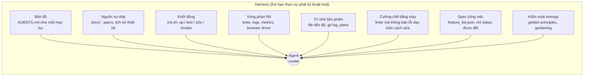
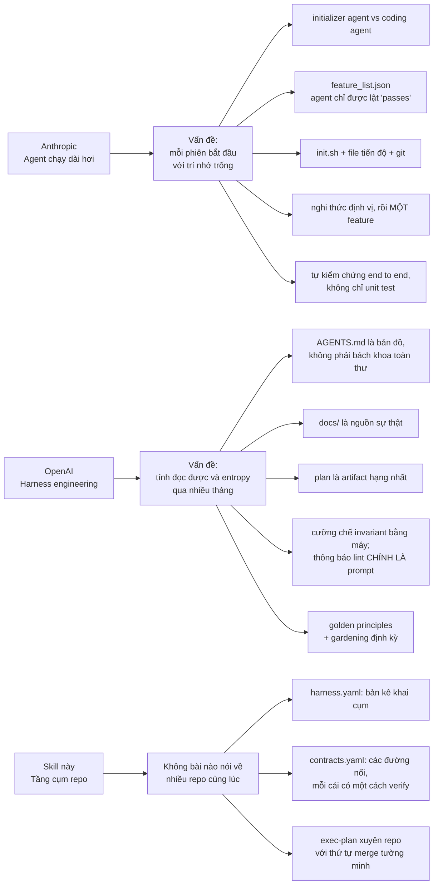
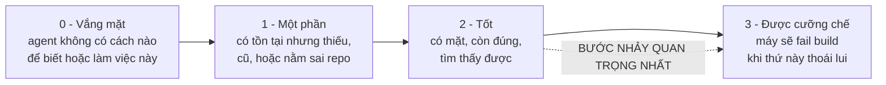
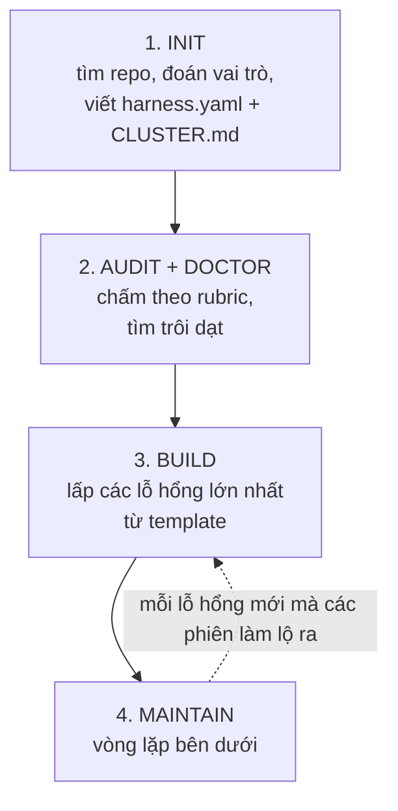
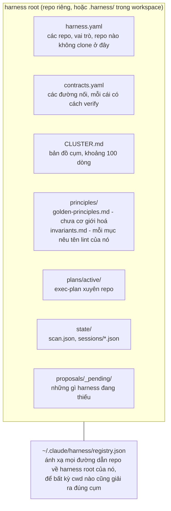
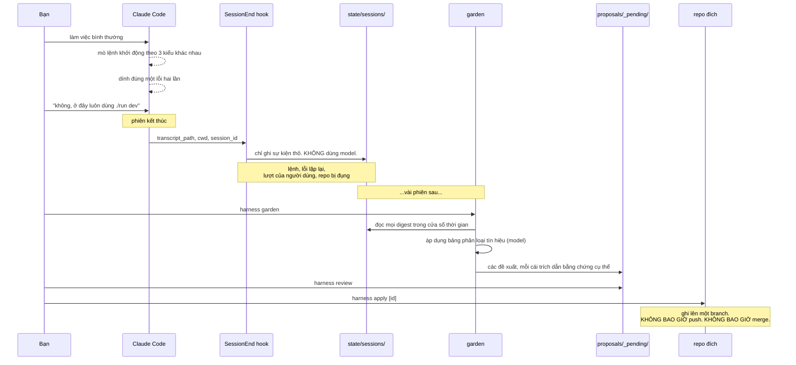
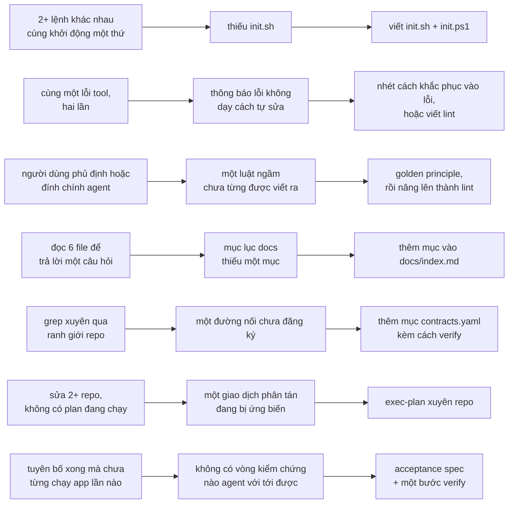
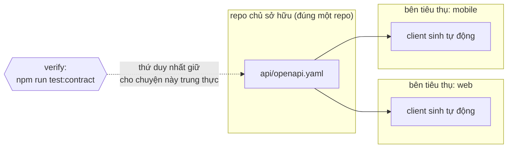
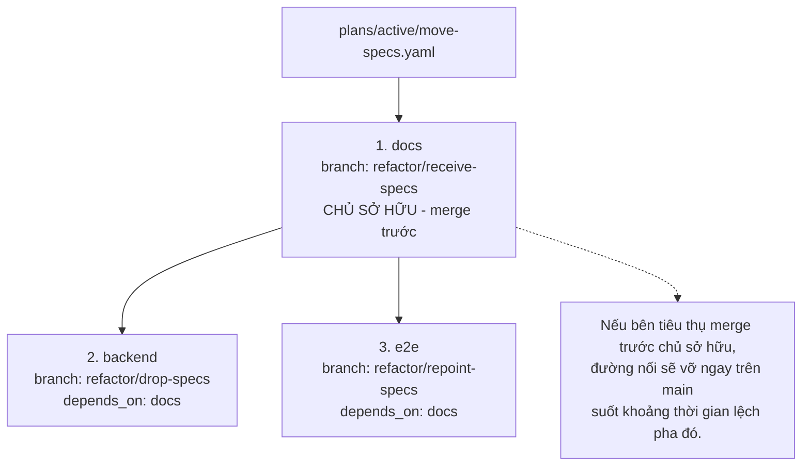

# Harness engineering: phương pháp luận cho cụm repo

> Thiết kế và lập luận đằng sau skill [`harness-engineering`](../skills/harness-engineering/).
>
> Nguồn:
> [Anthropic, *Effective harnesses for long-running agents*](https://www.anthropic.com/engineering/effective-harnesses-for-long-running-agents) (11/2025) và
> [OpenAI, *Harness engineering: leveraging Codex in an agent-first world*](https://openai.com/index/harness-engineering/) (02/2026).

---

## 1. Harness là gì

**Harness** là mọi thứ bao quanh agent mà không phải là model: tấm bản đồ nó đọc khi vừa đến, script khởi
động ứng dụng, bản spec định nghĩa thế nào là xong, con linter nói không, và cái plan sống sót qua ranh
giới context window.



Cả hai bài viết nguồn đi từ hai hướng ngược nhau nhưng hội tụ về cùng một kết luận:

> **Khi agent làm không tốt, thường là do môi trường bị đặc tả thiếu. Cách sửa gần như không bao giờ là
> "cố gắng hơn".**

OpenAI phát biểu điều này như một phản xạ mà team họ đã hình thành: khi Codex vật lộn, không có con người
nào nhảy vào viết code thay. Họ hỏi *năng lực nào đang thiếu, và làm sao để nó vừa đọc được vừa cưỡng chế
được?* rồi để chính Codex xây năng lực đó.

Phản xạ đó chính là toàn bộ phương pháp luận. Mọi thứ bên dưới chỉ là bộ máy để áp dụng nó một cách nhất
quán.

---

## 2. Mỗi nguồn đóng góp gì

Hai bài viết bổ sung cho nhau, không trùng lặp.



### Anthropic: trí nhớ vượt ranh giới context

Agent làm việc theo từng phiên rời rạc, mỗi phiên khởi đầu không có trí nhớ. Mô hình tư duy họ dùng: một
dự án được vận hành bởi các kỹ sư làm theo ca, và mỗi kỹ sư mới đến đều không nhớ gì cả.

Chỉ compaction thôi là không đủ. Hai kiểu hỏng xảy ra một cách có thể đoán trước:

- **One-shotting.** Agent cố làm mọi thứ cùng lúc, hết context giữa chừng, và để lại một feature xây dở
  không được ghi chép. Phiên kế tiếp phải đoán chuyện gì đã xảy ra và đốt sạch ngân sách chỉ để quay lại
  trạng thái chạy được.
- **Tuyên bố thắng lợi sớm.** Về sau trong dự án, agent nhìn quanh, thấy đã có tiến độ, rồi tuyên bố công
  việc đã xong.

Một chi tiết đáng bê nguyên xi: spec công việc là **JSON, không phải Markdown**. Đây không phải sở thích
phong cách. Họ đo được rằng model ít có khả năng tự tiện viết lại một file JSON mà nó được dặn là không
được đụng vào. Một bản spec mà agent thấy thoải mái sửa thì không còn là spec.

### OpenAI: tính đọc được và entropy

Ba kỹ sư (sau lên bảy) đã ship khoảng một triệu dòng qua chừng 1500 PR trong năm tháng với **zero dòng
code viết tay**. Tài nguyên khan hiếm chưa bao giờ là model. Nó là thời gian và sự chú ý của con người.

Nỗ lực "một file AGENTS.md thật to" của họ thất bại theo bốn cách, và danh sách này đáng thuộc lòng vì
mỗi mục đều là một cái bẫy mà nếu không biết bạn sẽ giẫm phải:

1. **Context là khan hiếm.** Một file hướng dẫn khổng lồ chiếm chỗ của chính task, của code, và của các
   tài liệu liên quan.
2. **Quá nhiều hướng dẫn trở thành không hướng dẫn.** Khi cái gì cũng quan trọng thì chẳng cái gì quan
   trọng, và agent quay ra bắt chước cục bộ thay vì điều hướng có chủ đích.
3. **Nó mục ngay lập tức.** Một cuốn cẩm nang nguyên khối biến thành nghĩa địa của các luật lệ lỗi thời.
   Agent không phân biệt được cái nào còn đúng, còn con người thì bỏ mặc không bảo trì.
4. **Nó không kiểm chứng được.** Một khối văn bản duy nhất không cho phép kiểm tra bằng máy về độ phủ, độ
   tươi, quyền sở hữu, hay liên kết chéo.

Thứ thay thế là khoảng 100 dòng đóng vai bản đồ, cộng với một thư mục `docs/` có cấu trúc, chính nó mới là
nguồn sự thật thật sự. Progressive disclosure: một điểm vào nhỏ và ổn định, dạy agent biết phải tìm tiếp ở
đâu.

Ý tưởng còn lại có đòn bẩy lớn không tương xứng: **thông báo lỗi của linter chính là một prompt.** Nó rơi
vào context của agent đúng lúc nó liên quan, và gửi đúng cho agent đang cần. Vậy nên đừng viết
`error: invalid import`. Hãy viết:

```
error: service.py imports from ui/ (layer violation: service must not depend on ui)
       Move the shared type into types/, or invert the dependency.
       See principles/invariants.md#layering.
```

Cái đầu bắt agent phải đoán. Cái sau đóng kín vòng lặp.

### Tầng cụm repo

Cả hai bài viết đều dành cho một repo đơn lẻ. Trong phạm vi một repo, linter còn giữ được phòng tuyến.
**Xuyên qua nhiều repo thì không có gì giữ cả.** Đó chính là chỗ harness thực sự rách, và đó là thứ skill
này bổ sung.

---

## 3. Bộ rubric: 11 chiều, thang 0 đến 3



Điểm 2 là một tài liệu nhờ vả tử tế. Điểm 3 là một cỗ máy nói không. Dưới throughput của agent, văn xuôi
không giữ nổi phòng tuyến: agent sao chép bất kỳ pattern nào nó thấy ở gần đó, và một đoạn văn không ngăn
được chúng.

| # | Chiều | Câu hỏi nó đặt ra | Cấp |
|---|---|---|---|
| 1 | Bản đồ | Agent vừa đến có biết mình đang ở đâu không? | repo |
| 2 | Nguồn sự thật | Tri thức nằm trong repo, hay trong đầu ai đó? | repo |
| 3 | Khả năng khởi động | Có chạy được thứ đó mà không phải suy luận lại cách chạy không? | repo |
| 4 | Vòng phản hồi | Nó có *nhìn thấy* thứ đó chạy không? | repo |
| 5 | Trí nhớ liên phiên | Cái gì sống sót qua context window? | repo |
| 6 | Cưỡng chế bằng máy | Luật nào được máy giữ? | repo |
| 7 | Spec công việc | "Xong" có phải thứ agent lặng lẽ định nghĩa lại được không? | repo |
| 8 | Kiểm soát entropy | Trôi dạt được trả nợ, hay được phép dồn lại? | repo |
| 9 | Bản kê khai cụm | Bản thân tập hợp các repo có đọc được không? | **cụm** |
| 10 | Sổ đăng ký contract | Cái gì băng qua ranh giới, và cái gì kiểm tra rằng nó còn đúng? | **cụm** |
| 11 | Điều phối xuyên repo | Một thay đổi trải trên nhiều repo là có kế hoạch, hay ứng biến? | **cụm** |

Đừng lấy trung bình. Một cụm chỉ mạnh bằng chiều **chịu lực** yếu nhất của nó, và chiều nào chịu lực thì
phụ thuộc vào công việc đang làm:

- Các phiên tự chủ dài chưa chạy được? **3, 5, 7** áp đảo.
- Các phiên chạy được nhưng chất lượng đang xuống? **6, 8** áp đảo.
- Thay đổi cứ liên tục làm vỡ repo anh em? **10, 11** áp đảo, và mấy thứ khác gần như vô nghĩa cho tới khi
  sửa xong hai chiều đó.

`audit` báo cáo **các lỗ hổng lớn nhất kèm hành động kế tiếp**, không bao giờ là một bảng điểm. Một rubric
in ra mười một con số cho mỗi repo sẽ biến thành thứ quan liêu chẳng ai đọc. Điểm số tồn tại để xếp hạng
lỗ hổng, không phải để trưng bày.

---

## 4. Xây một harness: bốn bước



### Bước 1: init

`init` đi khắp workspace, tìm mọi git repo, suy ra vai trò từng repo dựa vào những gì có trên đĩa (có
`pubspec.yaml` nghĩa là mobile, có dependency Angular nghĩa là frontend, có `manage.py` nghĩa là backend),
rồi ghi ra harness root:



Những repo thuộc cụm nhưng **không được clone trên máy này** nhận `present: false`. Đây là chuyện bình
thường và không được coi là lỗi. Điều thực sự quan trọng: *một repo vắng mặt thì không sao; một tài liệu
giả vờ rằng nó có mặt mới là vấn đề.*

### Bước 2: audit và doctor

`audit` chấm điểm cụm. `doctor` tìm những trôi dạt mà không điểm số nào bắt được:

- Một tài liệu trỏ tới `../some-repo/thing.md` mà file đó không tồn tại.
- Một repo được khai là present nhưng không có trên đĩa.
- Một `AGENTS.md` đã phình quá ngân sách số dòng và giờ đang chiếm chỗ context.
- Một đường nối không có phương pháp kiểm chứng (đó là tài liệu, không phải harness).
- **Một plan nói một đằng trong khi các branch nói một nẻo.** Kiểm tra rẻ tiền, và đúng thường xuyên hơn
  trí nhớ.
- **Bẫy hub-and-spoke**: một repo ôm năm mươi skill trong khi các repo anh em chỉ có một. Đó không phải là
  một hub đang hình thành, đó là tri thức xuyên suốt bị kẹt ở một chỗ tuỳ tiện.

### Bước 3: build

Lấp các lỗ hổng lớn nhất, theo đúng thứ tự mà audit đã xếp hạng. Nguyên tắc đặt chỗ:

> **Một artifact thuộc về đúng cấp của thứ mà nó mô tả.**
> Mô tả nội bộ một repo: nằm trong repo đó.
> Mô tả một đường nối giữa các repo: nằm ở harness root, trong `contracts.yaml`.
> Mô tả cách cả cụm vận hành: nằm ở harness root.

### Bước 4: maintain

Xem phần dưới. Đây là thứ biến nó thành một hệ thống thay vì một bộ template.

---

## 5. Vòng lặp maintain

Đây là phần cốt lõi. Mỗi lần vấp trong một phiên đều là **bằng chứng rằng harness đang thiếu thứ gì đó**.



### Bảng phân loại tín hiệu



### Hai quyết định thiết kế quyết định thành bại

**Hook không phân loại.** Nó ghi lại chuyện gì đã xảy ra rồi dừng. Việc phán "lượt nói đó của người dùng
có phải là đính chính không?" bằng regex chính xác là kiểu suy luận mong manh sinh ra một vòng lặp không
ai tin. Model sẽ diễn giải sau, theo lô, với bảng phân loại đặt ngay trước mặt.

**Gom lô không chỉ là tối ưu chi phí.** Một phiên mà agent mò lệnh khởi động thì đó là nhiễu. Cùng cái mò
đó qua ba phiên thì đó là một `init.sh` không tồn tại. Hầu hết tín hiệu chỉ đọc được khi xét qua nhiều
phiên. Mặc định: `min_sessions: 3`, `min_occurrences: 2`, `lookback_days: 14`.

Ngoại lệ, được mã hoá thẳng trong prompt: **một đính chính tường minh của người dùng và một lỗi tool lặp
lại, mỗi thứ được tính từ một lần xuất hiện duy nhất.** Đó là những tín hiệu không mơ hồ.

### Luật mà mọi đề xuất phải tuân thủ

1. **Trích dẫn bằng chứng.** Trích đúng phiên, đúng lệnh, đúng lỗi, hoặc đúng lượt nói của người dùng. Một
   đề xuất không chỉ được ra thứ đã kích hoạt nó thì chỉ là best practice chung chung, mà best practice
   chung chung chính là thứ vòng lặp này tuyệt đối không được sản xuất.
2. **Artifact nhỏ nhất đủ lấp lỗ hổng.** Thiếu một lệnh khởi động thì đó là một dòng trong `init.sh`,
   không phải một sáng kiến tài liệu hoá.
3. **Ưu tiên cưỡng chế hơn văn xuôi.** Nếu luật có thể cơ giới hoá được, hãy đề xuất con lint. Một đoạn văn
   là câu trả lời điểm 2 cho một vấn đề đang có sẵn câu trả lời điểm 3.
4. **Một đề xuất, một lỗ hổng.** Không bao giờ gộp.
5. **Nêu tên đích đến.** Một đề xuất không biết mình sẽ đi đâu thì không thể áp dụng được.

### Vì sao apply không bao giờ push

`apply` ghi lên một branch trong repo đích và từ chối thẳng nếu cây làm việc đang bẩn. Nó không push và
không merge. Việc tự động mở PR trên N repo là thực sự nguy hiểm, và bước review là thứ duy nhất đứng chắn
giữa một tín hiệu nhiễu và một mớ hỗn độn trong `main` của ai đó.

### Phép thử quyết định vòng lặp này có đáng giữ không

Sau lần `garden` thật đầu tiên, chọn ngẫu nhiên một đề xuất và hỏi:

> **Nó có nêu ra một chuyện cụ thể đã thực sự xảy ra không?**

Nếu có, vòng lặp hoạt động. Nếu nó nói "cân nhắc bổ sung thêm tài liệu", vòng lặp đang sản xuất rác: hãy
nâng `min_occurrences`, hoặc tắt hook đi.

**Một vòng lặp maintain huấn luyện bạn phớt lờ đầu ra của chính nó còn tệ hơn là không có vòng lặp
maintain nào.**

---

## 6. Đường nối: nơi cụm repo rách

Đường nối là bất cứ thứ gì băng qua ranh giới repo. Trong một repo, linter giữ được phòng tuyến; xuyên qua
nhiều repo thì không có gì giữ, trừ khi bạn tự xây.



Mỗi đường nối có bốn trường, và **trường cuối cùng mới là trường làm việc thật**:

```yaml
- name: spec-documents
  kind: shared-doc      # api-schema | shared-doc | event-name | env-var | db-schema | generated-client
  owner: docs           # đúng một repo sở hữu nó
  consumers: [backend, e2e]
  verify: "python scripts/check_spec_refs.py"
```

Một sổ đăng ký đường nối không có phương pháp kiểm chứng chỉ là danh sách những thứ bạn hy vọng là vẫn còn
đúng. Chiều số 10 của rubric chấm chính xác điều này: **2 điểm nếu đường nối được đăng ký, 3 điểm chỉ khi
có thứ gì đó kiểm tra nó.**

| Loại | Vỡ khi nào | Cách kiểm chứng rẻ tiền |
|---|---|---|
| `api-schema` | Chủ sở hữu đổi một field, bên tiêu thụ vẫn chờ field cũ | Contract test, hoặc sinh lại rồi diff |
| `shared-doc` | Chủ sở hữu đổi tên file, đường dẫn tương đối bên tiêu thụ treo lơ lửng | Giải mọi đường dẫn `../other-repo/...` |
| `event-name` | Một string literal bị đổi tên ở một phía | Grep cả hai phía, khẳng định cả hai đều tồn tại |
| `env-var` | Được thêm vào một deployment, bị quên ở deployment khác | Diff các key env đã khai giữa các repo |
| `generated-client` | Sinh lại ở một nơi, cũ mèm ở nơi khác | Checksum, hoặc đưa bước sinh code vào CI |

---

## 7. Thay đổi xuyên repo là giao dịch phân tán

Nếu ứng biến, một thay đổi trải trên nhiều repo sẽ hỏng đúng theo cách one-shotting hỏng trong một repo:
áp dụng dở dang, không có dấu vết về việc đã đi được tới đâu, và phiên kế tiếp không thể biết được.



Hai tính chất xứng đáng với công sức bỏ ra:

1. **Thứ tự merge là tường minh.** Chủ sở hữu merge trước các bên tiêu thụ, luôn luôn.
2. **`plan status` đọc trạng thái git thật rồi diff nó với plan.** Nó bắt được kiểu trôi dạt phổ biến nhất
   và cũng đáng xấu hổ nhất: plan nói một đằng, các branch nói một nẻo.

Ghi lại các quyết định ngay khi ra quyết định. Ba phiên sau, *cái gì* vẫn còn nằm trong diff. Nhưng *tại
sao* thì mất sạch trừ khi bạn đã viết nó xuống, vì compaction không giữ lại thứ đó.

---

## 8. Khi nào KHÔNG nên làm chuyện này

Nói thẳng, vì kiểu hỏng của bất kỳ phương pháp luận nào cũng là bị đem áp dụng ở nơi nó không thuộc về.

- **Chỉ có một repo.** Cứ dùng thẳng hai bài viết nguồn. Bạn không cần tầng cụm.
- **Các repo thực ra không chạm nhau.** Phép thử cho một cụm chỉ có một câu hỏi: *một thay đổi ở repo này
  có thường xuyên buộc phải thay đổi ở repo kia không?* Chung chủ sở hữu, chung tiền tố tên, và cùng nằm
  trong một thư mục đều không phải bằng chứng. Năm dự án trong một thư mục không phải là một cụm, và phương
  pháp luận này chỉ tổ thêm nghi thức rườm rà.
- **Cái cụm đó lẽ ra nên là một monorepo.** Nếu gần như mọi thay đổi đều đụng ba repo và mọi plan đều có
  cùng một thứ tự merge, thì ranh giới repo đang không gánh nổi phần việc của nó. Nó là một thứ thuế đánh
  lên mọi thay đổi. Đó mới là kết luận trung thực của bản audit, và không lượng scaffolding nào sửa được.
  Hãy nói thẳng ra thay vì xây bộ máy ngày càng cầu kỳ quanh một sự chia tách chẳng còn phục vụ ai.

---

## 9. Điều duy nhất cần nhớ

Chính lời cảnh báo của OpenAI về mức tự chủ end-to-end của họ áp dụng cho mọi thứ ở đây:

> nó "phụ thuộc rất nhiều vào cấu trúc và bộ công cụ cụ thể của repo này và không nên mặc định là sẽ khái
> quát hoá được nếu không có một khoản đầu tư tương đương."

**Harness là thứ phải giành được, không phải thứ cài đặt vào.** Bộ công cụ trong skill này xếp hạng các lỗ
hổng và tự động hoá việc thu thập bằng chứng. Nó không thể đầu tư thay bạn. Thứ nó làm được là đảm bảo
rằng mỗi lần agent vấp, cú vấp đó không bị lãng phí.
